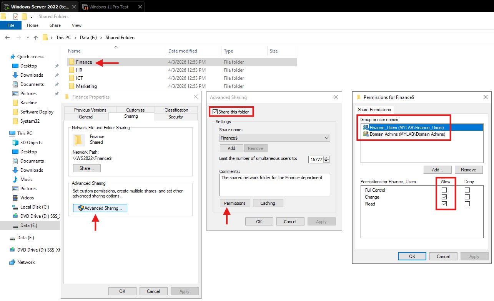
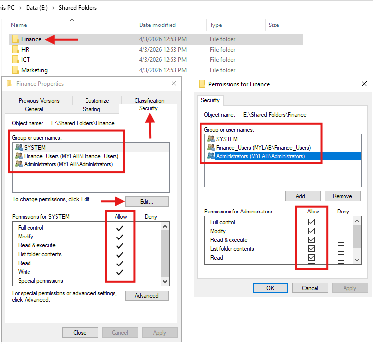
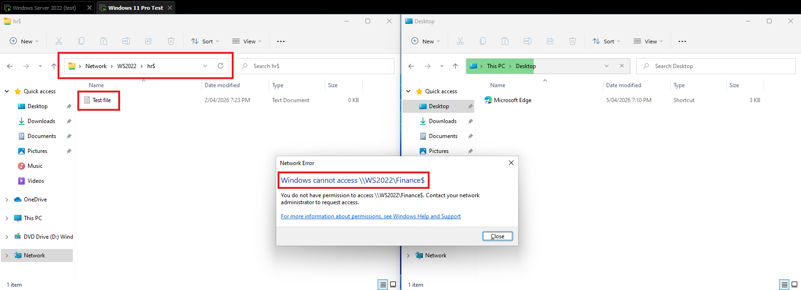
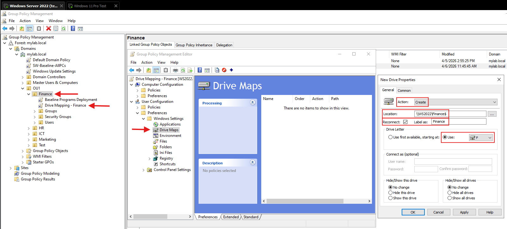
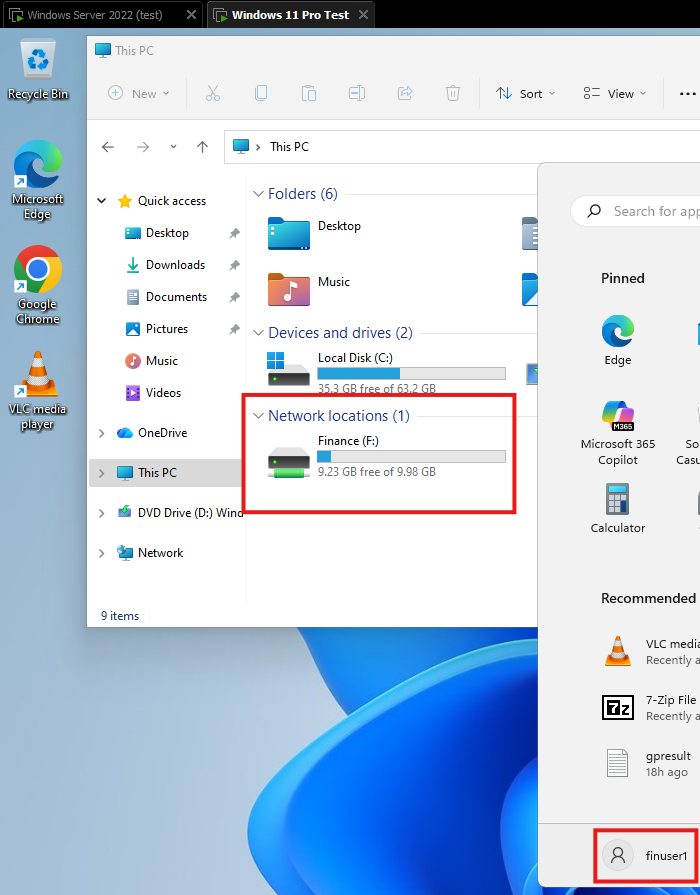

# Department Drive Mapping with Group Policy — MYLAB.LOCAL

End-to-end walkthrough of configuring automatic, OU-scoped network drive mapping for four departments on a Windows Server 2022 domain controller, using share permissions, NTFS permissions, and Group Policy Preferences.

## What this project demonstrates

- Active Directory OU and security group design
- Share and NTFS permission layering for least-privilege access
- Group Policy Preferences for user-targeted drive mapping
- Client-side verification using `gpresult`, `gpupdate`, and UNC path testing
- Troubleshooting methodology for common drive mapping failures

## Lab environment

| Component | Detail |
|---|---|
| Domain controller | WS2022.mylab.local (Windows Server 2022 Datacenter) |
| Client | Windows 11 Pro, domain-joined |
| Platform | VMware Workstation |
| Domain | mylab.local |
| Organisational Units | Finance, HR, ICT, Marketing |

---

## Overview

Maps department shared folders as network drives automatically when users log on. Each department gets its own GPO linked to its OU, so users only see the drive for their department.

### Drive mapping plan

| Department | Shared Folder | Share Name | Drive Letter | GPO Name | Linked To |
|---|---|---|---|---|---|
| Finance | `E:\Shared Folders\Finance` | Finance$ | F: | Drive Mapping - Finance | Finance OU |
| HR | `E:\Shared Folders\HR` | HR$ | H: | Drive Mapping - HR | HR OU |
| ICT | `E:\Shared Folders\ICT` | ICT$ | I: | Drive Mapping - ICT | ICT OU |
| Marketing | `E:\Shared Folders\Marketing` | Marketing$ | M: | Drive Mapping - Marketing | Marketing OU |

---

## 1. Share the folders on the DC (one-time setup)

Each department folder gets its own share with permissions restricted to that department's security group. The steps below use Finance as the example.

1. Right-click the folder (e.g., `E:\Shared Folders\Finance`) → **Properties** → **Sharing** tab.
2. Click **Advanced Sharing** → tick **Share this folder**.
3. Set share name to **Finance$** (the `$` hides it from casual network browsing).
4. Click **Permissions**:
   - Remove **Everyone**.
   - Add **Finance_Users** → set to **Change** (allows read and write — users need to save files here).
   - Add **Domain Admins** → set to **Full Control**.
5. Click OK → **Apply**.



Repeat for each department with the matching security group:

| Share | Security Group | Permission |
|---|---|---|
| Finance$ | Finance_Users | Change |
| HR$ | HR_Users | Change |
| ICT$ | ICT_Users | Change |
| Marketing$ | Marketing_Users | Change |

All four shares also get **Domain Admins** with **Full Control**.

> **Why Change and not just Read?** A mapped department drive is a working folder — users need to create, edit, and delete files. Read-only would make it useless as a shared drive.

> **Why not Domain Users?** Using Domain Users on the share would let any user in the domain access any department's folder by typing the UNC path manually. By restricting each share to its department's security group, only Finance_Users can reach the Finance share — even if someone guesses the path.

---

## 2. Set NTFS permissions on each folder

Right-click the folder → **Properties** → **Security** tab → **Edit**.

For the Finance folder:

| Principal | Permission |
|---|---|
| Finance_Users | Modify |
| Domain Admins | Full Control |



Repeat for each department with the matching security group:

| Folder | Security Group | Permission |
|---|---|---|
| Finance | Finance_Users | Modify |
| HR | HR_Users | Modify |
| ICT | ICT_Users | Modify |
| Marketing | Marketing_Users | Modify |

All four folders also get **Domain Admins** with **Full Control**.

> **Two layers of protection:** Share permissions (step 1) control access over the network. NTFS permissions (this step) control access at the file system level. Both are restricted to the department's security group. The effective permission is the most restrictive of the two combined — so even if one layer is misconfigured, the other still blocks unauthorised access.

---

## 3. Test share access from the client BEFORE creating GPOs

Log into the client as a Finance user (e.g., `MYLAB\finuser1`) and run:

```
dir \\WS2022\Finance$
```

This should return successfully. Then test that access is properly restricted:

```
dir \\WS2022\HR$
```

This should fail with **Access is denied** — confirming that Finance users cannot access the HR share. If it succeeds, your share or NTFS permissions are too broad.



Repeat this check for each department — log in as a user from that department and confirm they can access their own share but not the others.

---

## 4. Create the GPO (repeat for each department)

The steps below use Finance as the example. Repeat the same process for HR, ICT, and Marketing with the corresponding values from the drive mapping plan table above.

1. Open **GPMC** (`gpmc.msc`).
2. Expand Forest → Domains → mylab.local.
3. Right-click the **Finance** OU → **Create a GPO in this domain, and Link it here**.
4. Name it **Drive Mapping - Finance**.

---

## 5. Configure the mapped drive

1. Right-click **Drive Mapping - Finance** → **Edit**.
2. Navigate to: **User Configuration → Preferences → Windows Settings → Drive Maps**.
3. Right-click in the right pane → **New** → **Mapped Drive**.
4. Configure:
   - **Action:** Create
   - **Location:** `\\WS2022\Finance$`
   - **Reconnect:** Ticked
   - **Label as:** Finance
   - **Drive Letter:** Use → **F:**
5. Click the **Common** tab:
   - Tick **Run in logged-on user's security context**.
6. Click **OK**.
7. Close the editor.



> **Why "Run in logged-on user's security context"?** By default, GPO Preferences run as SYSTEM, which may not have access to your share. Ticking this ensures the drive maps using the user's own credentials, which is what you want.

---

## 6. Repeat for the other departments

| GPO | Link to OU | Location | Label | Drive Letter |
|---|---|---|---|---|
| Drive Mapping - Finance | Finance | `\\WS2022\Finance$` | Finance | F: |
| Drive Mapping - HR | HR | `\\WS2022\HR$` | HR | H: |
| Drive Mapping - ICT | ICT | `\\WS2022\ICT$` | ICT | I: |
| Drive Mapping - Marketing | Marketing | `\\WS2022\Marketing$` | Marketing | M: |

---

## 7. Verify

1. Make sure you have at least one user account in each OU (e.g., finuser1 in Finance OU).
2. Log into the client as a Finance OU user (e.g., `MYLAB\finuser1`).
3. Open **File Explorer** — the **F:** drive should appear with the label "Finance".
4. Test that you can create and save a file on the F: drive.
5. Log off and log in as an ICT OU user — only the **I:** drive should appear, not F:.



> **Important:** Drive mapping uses **User Configuration**, not Computer Configuration. This means it applies based on **who logs in**, not which PC they're on. A Finance user gets the F: drive regardless of which PC in the domain they log into. This also means `gpupdate /force` is enough to test — no restart required. You may need to sign out and back in for the drive to appear in Explorer.

---

## 8. Troubleshooting drive mapping

**Drive doesn't appear after login:**
- Is the user account actually inside the correct OU? Check in ADUC — the user object must be directly inside the Finance OU, not just a member of a Finance group.
- Run `gpresult /r` as the user and check under **User Settings → Applied Group Policy Objects** — is the Drive Mapping GPO listed?
- Is the share accessible? Run `dir \\WS2022\Finance$` as the user.

**Drive appears but is empty or access denied:**
- Check NTFS permissions on the folder. The user needs at least Read (or Modify if they need to save files).
- Check share permissions — the user needs at least Change.

**Drive letter conflicts:**
- If a drive letter is already in use (e.g., a USB drive on F:), the mapping silently fails. Choose drive letters that are unlikely to conflict. F, H, I, M are generally safe choices.

---

## Key concepts reinforced in this build

| Concept | Where it appears |
|---|---|
| Least-privilege access | Share and NTFS restricted to department security groups, Everyone removed |
| Defence in depth | Share + NTFS permissions both enforced independently |
| Hidden shares | `$` suffix on share names to reduce casual discovery |
| OU-scoped policy | Each GPO linked to its department OU, not the domain root |
| User Configuration vs Computer Configuration | Drive maps follow the user, not the machine |
| Pre-deployment verification | Share access tested directly before GPO work begins |
